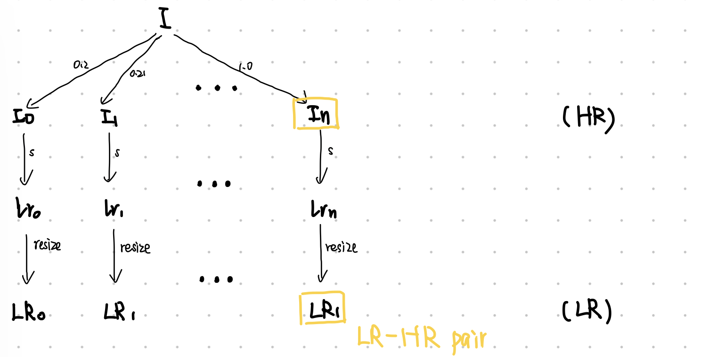
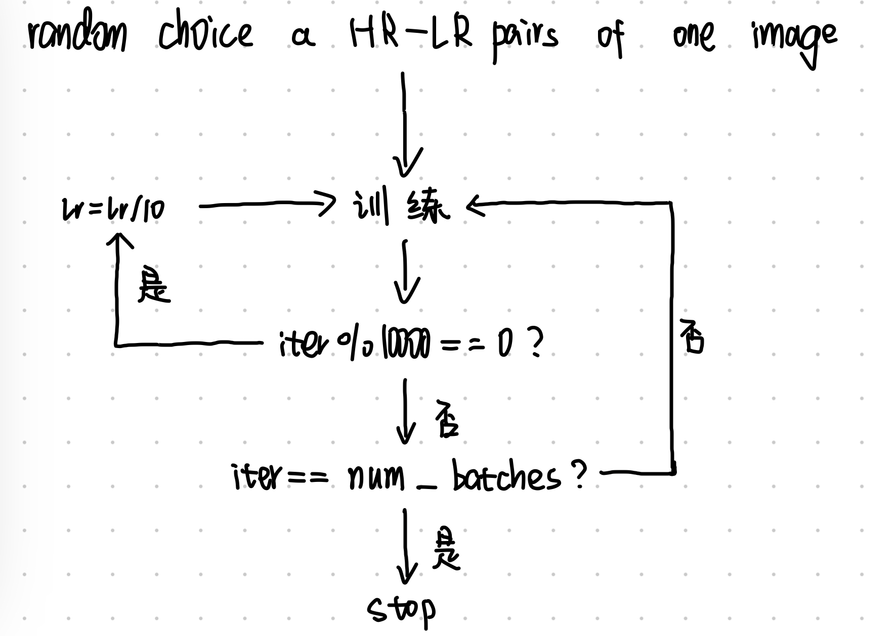

# Unofficial PyTorch implementation of  "Zero-Shot" Super-Resolution using Deep Internal Learning

Unofficial Implementation of *1712.06087 "Zero-Shot" Super-Resolution using Deep Internal Learning by Assaf Shocher, Nadav Cohen, Michal Irani.*
 
Official Project page: http://www.wisdom.weizmann.ac.il/~vision/zssr/

Paper: https://arxiv.org/abs/1712.06087


----------


This trains a deep neural network to perform super resolution using a single image.

The network is not trained on additional images, and only uses information from within the target image.
Pairs of high resolution and low resolution patches are sampled from the image, and the network fits their difference.


----------


TODO:
- Implement additional augmentation using the "Geometric self ensemble" mentioned in the paper.
- Implement gradual increase of the super resolution factor as described in the paper.
- Support for arbitrary kernel estimation and sampling with arbitrary kernels.  The current implementation interpolates the images bicubic interpolation.

Deviations from paper:
- Instead of fitting  the loss and analyzing it's standard deviation, the network is trained for a constant number of batches. The learning rate shrinks x10 every 10,000 iterations.


# Usage 
Example: ```python train.py --img img.png```
```
usage: train.py [-h] [--num_batches NUM_BATCHES] [--crop CROP] [--lr LR]
                [--factor FACTOR] [--img IMG]

optional arguments:
  -h, --help            show this help message and exit
  --num_batches NUM_BATCHES
                        Number of batches to run
  --crop CROP           Random crop size
  --lr LR               Base learning rate for Adam
  --factor FACTOR       Interpolation factor.
  --img IMG             Path to input img
```


**论文 --> code跑通 --> 啃代码 --> （改）**

**1.训练阶段：每次仅训练一张图像I，将I进行多次缩放。factors列表包含了所有的缩放比例，缩放后的图像记为I<sub>0</sub>，I<sub>1</sub>，...I<sub>n</sub>，将他们用作训练阶段的HR。再将I<sub>i</sub>作s倍的下采样以得到训练阶段的LR，但由于CNN的输入输出尺寸一致，因此LR还需要resize至与HR尺寸相同。以上，就得到了训练阶段的HR-LR pairs。图示如下：**



**对于一张图像，上述操作可得到它的99个不同尺寸的HR-LR pairs。在每个iteration中随机选择一个pair，这个选择并不是均匀分布的，而是与HR的大小成正比，也就是说HR越大就越可能被送去训练CNN。每经过一次前传+反向传播，iteration就增加1，当iteration%10000==0时，将学习率缩小十倍。默认情况下，一张图像的训练次数为num_batches = 15000次。图示如下：**



**Note：图像增强是先选择HR-LR pair，再对pair进行图像增强。**

**2.测试阶段：将图像I进行上采样，因为CNN被训练为预测residual（HR-LR），因此输入CNN得到residual。本任务是基于灰度图像的，所以像素值的最值为1和0。**